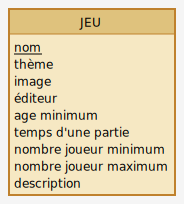

# Une API pour les jeux de société !

On va créer une API qui va nous permettre d'enregistrer des jeux de sociétés dans une base de données.

## MCD

Le MCD ne comprendra qu'une seule table dans laquelle on va enregistrer nos jeux de société.

## Création de la DB

On va créer par script une base de données avec un rôle pour la gérer.

## Création de la table

On va utiliser SQITCH pour créer notre table.

## Mise en place de l'architecture EXPRESS

On met en place une architecture avec une route qui répond au post pour enregistrer les jeux de sociétés en BDD

## Fonction SQL

On crèe une fonction SQL destinée à l'enregistrement de nos jeux de société. On la déploie avec SQITCH.